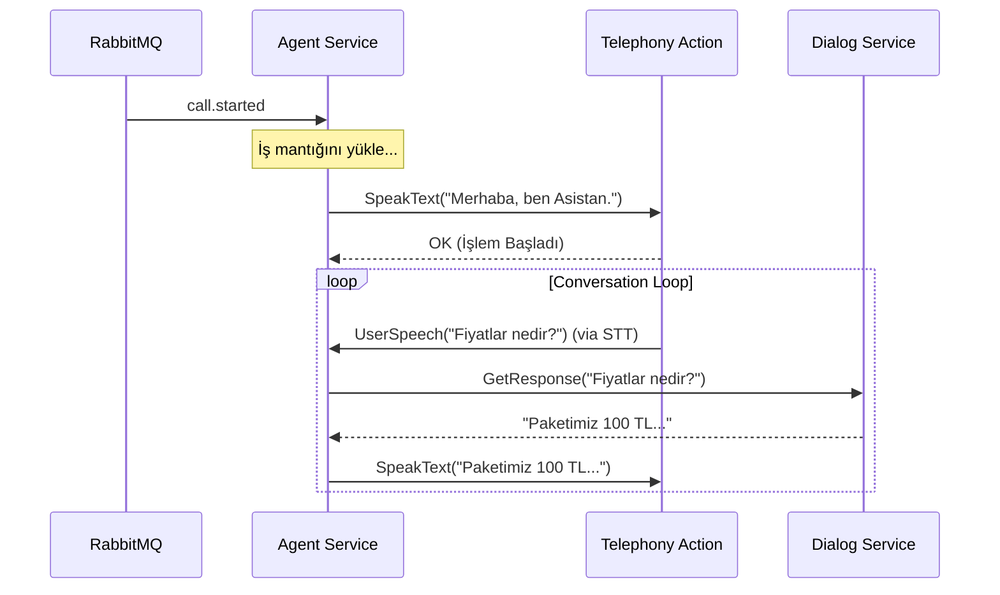

# 🧠 Sentiric Agent Service - Mantık Mimarisi (Final)

**Rol:** Orkestra Şefi. Asenkron iş mantığı yürütücüsü.

## 1. Çalışma Prensibi (Event-Driven SAGA)

Bu servis HTTP veya SIP dinlemez. Sadece `RabbitMQ` dinler.

### Senaryo: Çağrı Başlangıcı

1.  **Tetiklenme:** `call.started` olayı gelir.
2.  **Bağlam (Context) Yükleme:**
    *   Redis'ten veya olaydan `dialplan` bilgisini al.
    *   Kullanıcıyı `user-service` üzerinden doğrula (veya misafir olarak işaretle).
3.  **Karar (Logic):**
    *   Eğer `START_AI_CONVERSATION` ise:
        *   `telephony-action-service`'e "Karşılama mesajını çal" (`SpeakText`) emrini gönder.
        *   `stt-gateway`'i tetikle (Dinlemeye başla).
    *   Eğer `PLAY_ANNOUNCEMENT` ise:
        *   `telephony-action-service`'e "Şu dosyayı çal" (`PlayAudio`) emrini gönder.

## 2. Servis Etkileşim Haritası

---