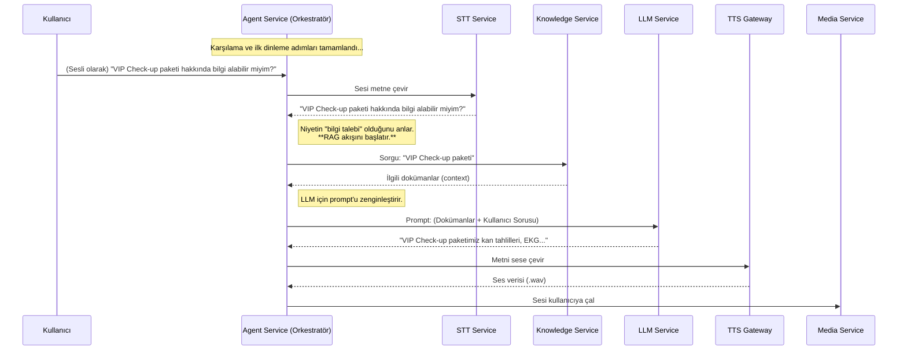

# 🧠 Sentiric Agent Service - Mantık ve Akış Mimarisi

**Belge Amacı:** Bu doküman, `agent-service`'in Sentiric platformunun **merkezi asenkron beyni (orkestratörü)** olarak stratejik rolünü, temel çalışma prensiplerini ve diğer servislerle olan etkileşimini açıklar. `TASKS.md` "ne inşa edileceğini", bu doküman ise "neden ve nasıl çalıştığını" anlatır.

---

## 1. Stratejik Rol: "Asenkron Orkestra Şefi"

`sip-signaling-service` çağrıyı senkron olarak kurduktan sonra, `agent-service` görevi devralır. Temel sorumluluğu, uzun süren ve karmaşık diyalog akışlarını **asenkron** olarak yönetmektir.

**Bu servis sayesinde platform:**
1.  **Dayanıklı Olur:** Bir AI servisi (LLM/STT/TTS) yavaş yanıt verse bile, bu durum çağrıyı kuran `sip-signaling` servisini meşgul etmez. Her çağrı kendi izole sürecinde (goroutine) yönetilir.
2.  **Akıllı Olur:** `dialplan`'den gelen "Ne yap?" komutunu (`action`), "Nasıl yap?" adımlarına (`media`, `stt`, `llm`, `tts` servislerini çağırma) dönüştürür.
3.  **Bağlamsal Zeka Sağlar:** **`knowledge-service` (Kurumsal Hafıza)** ile **`llm-service` (Beyin)** arasında köprü görevi görerek, LLM'in doğru ve güncel bilgilerle yanıt vermesini sağlar.

---

## 2. Temel Çalışma Prensibi: Olay Tüketimi ve Durum Makinesi

Servis, `RabbitMQ`'dan gelen olayları dinleyen bir "tüketici" (consumer) olarak çalışır.

*   **Tetiklenme:** `sip-signaling` bir çağrıyı başarıyla kurduğunda, `call.started` olayını `RabbitMQ`'ya yayınlar.
*   **Devralma:** `agent-service` bu olayı alır, çağrıya ait tüm bilgileri (`dialplan` kararı, kullanıcı bilgileri vb.) okur.
*   **Yönetim:** Her çağrı için bir "Durum Makinesi" (State Machine) başlatır. Çağrının durumu (`CurrentState`) Redis'te saklanır ve `WELCOMING` -> `LISTENING` -> `THINKING` -> `SPEAKING` gibi adımlar arasında geçiş yaparak diyalog yönetilir.

---

## 3. Uçtan Uca Diyalog Akışı: RAG Destekli Bir Konuşma Döngüsü

Bir çağrı başladıktan sonra `agent-service`'in yönettiği, **`knowledge-service`'i de içeren** tipik bir konuşma döngüsü şöyledir:

