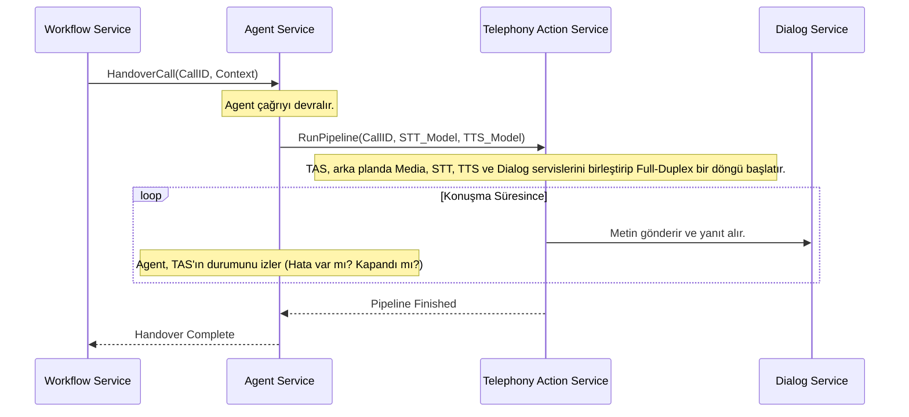

# 🧠 Sentiric Agent Service - Mantık Mimarisi (v3.0)

**Rol:** Konuşma Uzmanı (Conversation Specialist). Bir çağrının baştan sona yönetimiyle (yönlendirme, sonlandırma) ilgilenmez; sadece kendisine verilen **İnsan-Makine diyalog anını** yönetir.

## 1. Sisteme Entegrasyonu (The Trigger)

Agent Service, çağrı akışının neresinde devreye gireceğine kendi karar vermez. 
**Workflow Service**, veritabanındaki kuralları (JSON) işlerken "AI Devreye Girsin" (Handover to Agent) adımına geldiğinde, Agent Service'i bir gRPC çağrısı ile uyandırır.

## 2. Çalışma Prensibi (The Executor)

Agent Service uyandırıldığında, asıl "Ağır İşçi" olan `Telephony Action Service`'i (TAS) kullanır.

```mermaid
sequenceDiagram
    participant WF as Workflow Service
    participant Agent as Agent Service
    participant TAS as Telephony Action Service
    participant Dialog as Dialog Service
    
    WF->>Agent: HandoverCall(CallID, Context)
    Note over Agent: Agent çağrıyı devralır.
    
    Agent->>TAS: RunPipeline(CallID, STT_Model, TTS_Model)
    Note over TAS: TAS, arka planda Media, STT, TTS ve Dialog servislerini birleştirip Full-Duplex bir döngü başlatır.
    
    loop Konuşma Süresince
        TAS->>Dialog: Metin gönderir ve yanıt alır.
        Note over Agent: Agent, TAS'ın durumunu izler (Hata var mı? Kapandı mı?)
    end
    
    TAS-->>Agent: Pipeline Finished
    Agent-->>WF: Handover Complete
```

## 3. Kesin Sınırlar (Boundaries)

*   **Gateway'lerle Konuşmaz:** Agent servisi STT, TTS veya LLM Gateway'lerine doğrudan ağ isteği atmaz. Bu işi `telephony-action-service` (TAS) yapar.
*   **SIP ile İlgilenmez:** Çağrının nasıl geldiğini, B2BUA'yı veya Proxy'yi bilmez.
*   **Orkestrasyon:** Agent'ın tek orkestrasyon görevi, TAS'ı doğru parametrelerle başlatmak ve gerektiğinde durdurmaktır.

---
