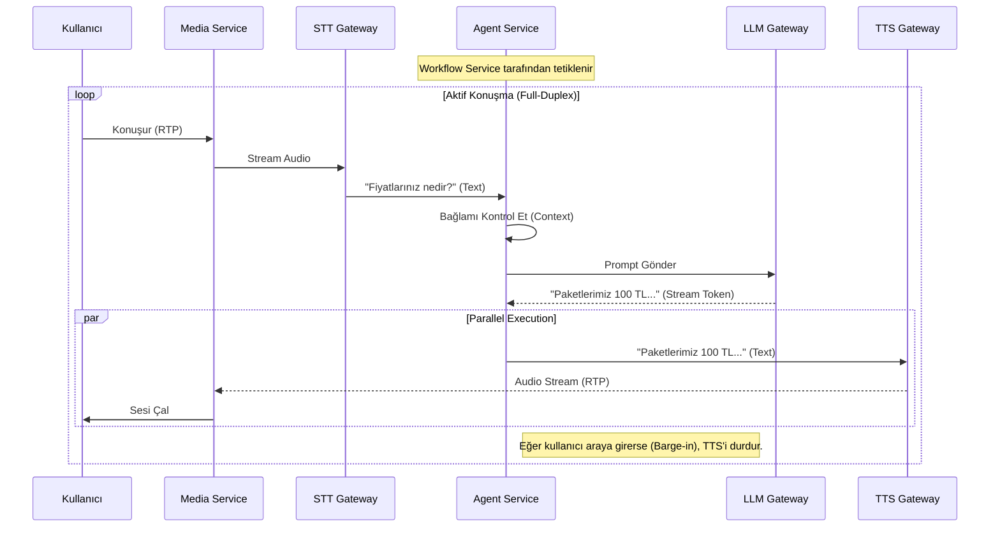

# 🧠 Agent Service - Mantık Mimarisi (v3.0 - Conversation Specialist)

**Rol:** Konuşma Uzmanı. Sadece kendisine atanan aktif bir konuşmayı yönetir.

## 1. Çalışma Prensibi (Dialogue Loop)

Bu servis, bir çağrının *yönlendirmesiyle* ilgilenmez. Sadece **Ses/Metin** akışıyla ilgilenir.

```mermaid
sequenceDiagram
    participant User as Kullanıcı
    participant Media as Media Service
    participant STT as STT Gateway
    participant Agent as Agent Service
    participant LLM as LLM Gateway
    participant TTS as TTS Gateway

    Note over Agent: Workflow Service tarafından tetiklenir

    loop Aktif Konuşma (Full-Duplex)
        User->>Media: Konuşur (RTP)
        Media->>STT: Stream Audio
        STT->>Agent: "Fiyatlarınız nedir?" (Text)
        
        Agent->>Agent: Bağlamı Kontrol Et (Context)
        Agent->>LLM: Prompt Gönder
        LLM-->>Agent: "Paketlerimiz 100 TL..." (Stream Token)
        
        par Parallel Execution
            Agent->>TTS: "Paketlerimiz 100 TL..." (Text)
            TTS-->>Media: Audio Stream (RTP)
            Media->>User: Sesi Çal
        end
        
        Note right of Agent: Eğer kullanıcı araya girerse (Barge-in), TTS'i durdur.
    end
```

## 2. Sorumluluk Sınırları

*   ❌ **Arama Başlatmaz:** `call.started` olayına tepki vermez (Bu artık Workflow'un işi).
*   ❌ **Arama Sonlandırmaz:** Konuşma bittiğinde Workflow'a "Diyalog Bitti" sinyali gönderir, hattı Workflow kapatır.
*   ✅ **Kişilik Bürünür:** Satışçı, Destek, Tekniker modlarına girer.

---
