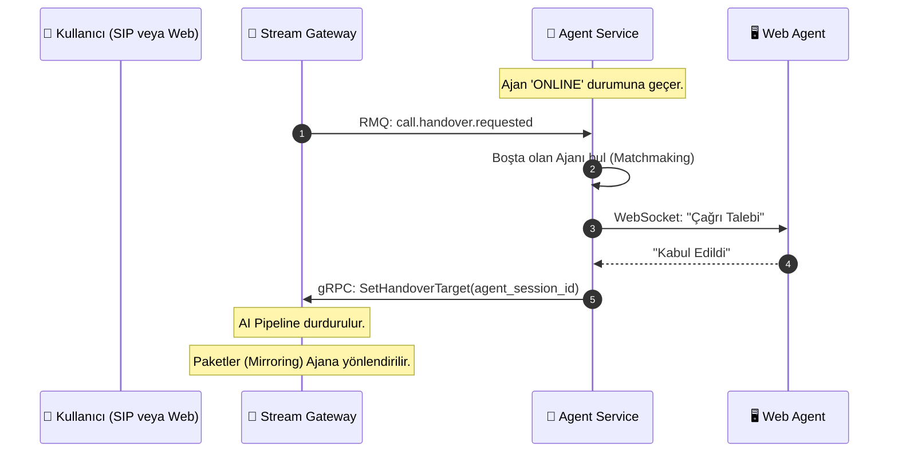

# 🧬 Agent Orchestration & Handover Logic

Bu belge, Sentiric platformunun en kritik özelliği olan "İnsana Devir" (Agent Handover) ve "Birleşik Köprü" (Unified Bridge) mantığını açıklar.

## 1. Unified Agent Bridge (Birleşik Köprü)
Sentiric'te ajanlar her zaman **Web-Native**'dir. İster telefon (SIP), ister web sitesi üzerinden bir çağrı gelsin, ajan her zaman `stream-sdk` (WebSocket) üzerinden konuşur.

### Köprüleme Akışı (Diyagram)

```mermaid
sequenceDiagram
    autonumber
    participant User as 👤 Kullanıcı (SIP veya Web)
    participant Gateway as 🌊 Stream Gateway
    participant AgentSvc as 🏢 Agent Service
    participant AgentUI as 🖥️ Web Agent

    Note over AgentSvc: Ajan 'ONLINE' durumuna geçer.
    Gateway->>AgentSvc: RMQ: call.handover.requested
    AgentSvc->>AgentSvc: Boşta olan Ajanı bul (Matchmaking)
    AgentSvc->>AgentUI: WebSocket: "Çağrı Talebi"
    AgentUI-->>AgentSvc: "Kabul Edildi"
    AgentSvc->>Gateway: gRPC: SetHandoverTarget(agent_session_id)
    
    Note over Gateway: AI Pipeline durdurulur.
    Note over Gateway: Paketler (Mirroring) Ajana yönlendirilir.
```

## 2. Matchmaking (Eşleştirme) Algoritması
Ajan servisi, gelen talepleri şu hiyerarşiye göre dağıtır:
1. **Direct Match:** Eğer kullanıcı daha önce belirli bir ajanla konuştuysa ona öncelik ver.
2. **Skills-based:** Kullanıcının seçtiği dile (tr-TR, en-US) uygun ajanı bul.
3. **Round Robin:** En uzun süredir boşta bekleyen (Idle) ajana çağrıyı aktar.

## 3. Ajan Durum Yönetimi (FSM)
Ajanlar şu durumlarda bulunabilir:
* `OFFLINE`: Bağlı değil.
* `ONLINE`: Çağrı bekliyor.
* `BUSY`: Aktif bir görüşmede.
* `BREAK`: Mola modunda (Çağrı almaz).
Bu durumlar **Redis Hash** üzerinde TTL (Time-To-Live) ile tutulur.
