# 🧠 Sentiric Agent Service - Mantık ve Akış Mimarisi

**Belge Amacı:** Bu doküman, `agent-service`'in Sentiric platformunun **merkezi asenkron beyni (orkestratörü)** olarak stratejik rolünü, temel çalışma prensiplerini ve diğer servislerle olan etkileşimini açıklar. `TASKS.md` "ne inşa edileceğini", bu doküman ise "neden ve nasıl çalıştığını" anlatır.

---

## 1. Stratejik Rol: "Asenkron Orkestra Şefi"

`sip-signaling-service` çağrıyı senkron olarak kurduktan sonra, `agent-service` görevi devralır. Temel sorumluluğu, uzun süren ve karmaşık diyalog akışlarını **asenkron** olarak yönetmektir.

**Bu servis sayesinde platform:**
1.  **Dayanıklı Olur:** Bir AI servisi (LLM/STT/TTS) yavaş yanıt verse bile, bu durum çağrıyı kuran `sip-signaling` servisini meşgul etmez. Her çağrı kendi izole sürecinde (goroutine) yönetilir.
2.  **Akıllı Olur:** `dialplan`'den gelen "Ne yap?" komutunu (`action`), "Nasıl yap?" adımlarına (`media`, `stt`, `llm`, `tts` servislerini çağırma) dönüştürür.
3.  **Durum Yönetimi Sağlar:** Her çağrının diyalog geçmişini ve mevcut durumunu (`WELCOMING`, `LISTENING` vb.) Redis üzerinde tutarak konuşmanın bağlamını korur.

---

## 2. Temel Çalışma Prensibi: Olay Tüketimi ve Durum Makinesi

Servis, `RabbitMQ`'dan gelen olayları dinleyen bir "tüketici" (consumer) olarak çalışır.

*   **Tetiklenme:** `sip-signaling` bir çağrıyı başarıyla kurduğunda, `call.started` olayını `RabbitMQ`'ya yayınlar.
*   **Devralma:** `agent-service` bu olayı alır, çağrıya ait tüm bilgileri (`dialplan` kararı, kullanıcı bilgileri vb.) okur.
*   **Yönetim:** Her çağrı için bir "Durum Makinesi" (State Machine) başlatır. Çağrının durumu (`CurrentState`) Redis'te saklanır ve `WELCOMING` -> `LISTENING` -> `THINKING` -> `SPEAKING` gibi adımlar arasında geçiş yaparak diyalog yönetilir.

---

## 3. Uçtan Uca Diyalog Akışı: Bir Konuşma Döngüsü

Bir çağrı başladıktan sonra `agent-service`'in yönettiği tipik bir konuşma döngüsü şöyledir:

```mermaid
sequenceDiagram
    participant RabbitMQ
    participant AgentService as Agent Service (Orkestratör)
    participant Redis
    participant STTService as STT Service
    participant LLMService as LLM Service
    participant TTSGateway as TTS Gateway
    participant MediaService as Media Service

    RabbitMQ->>AgentService: `call.started` olayı
    AgentService->>Redis: Yeni `CallState` oluştur (State: WELCOMING)
    
    Note over AgentService: **Karşılama Aşaması**
    AgentService->>LLMService: Karşılama metni üret
    LLMService-->>AgentService: "Merhaba Azmi, nasıl yardımcı olabilirim?"
    AgentService->>TTSGateway: Metni sese çevir
    TTSGateway-->>AgentService: Ses verisi (.wav)
    AgentService->>MediaService: Sesi kullanıcıya çal (PlayAudio)
    AgentService->>Redis: Durumu güncelle (State: LISTENING)

    Note over AgentService: **Dinleme & Anlama Aşaması**
    AgentService->>MediaService: Kullanıcı sesini dinle (RecordAudio stream)
    MediaService-->>AgentService: Anlık ses akışı (PCM data)
    AgentService->>STTService: Sesi metne çevir (WebSocket stream)
    STTService-->>AgentService: "Randevu almak istiyorum"
    AgentService->>Redis: Durumu güncelle (State: THINKING)

    Note over AgentService: **Düşünme & Yanıtlama Aşaması**
    AgentService->>LLMService: Bağlam + "Randevu almak istiyorum"
    LLMService-->>AgentService: "Elbette, hangi tarih için?"
    AgentService->>TTSGateway: Metni sese çevir
    TTSGateway-->>AgentService: Ses verisi (.wav)
    AgentService->>MediaService: Sesi kullanıcıya çal
    AgentService->>Redis: Durumu güncelle (State: LISTENING)
```

